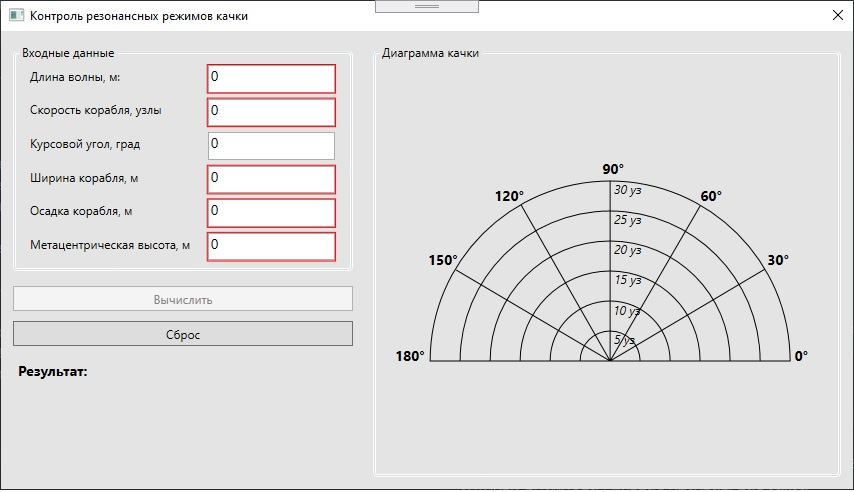
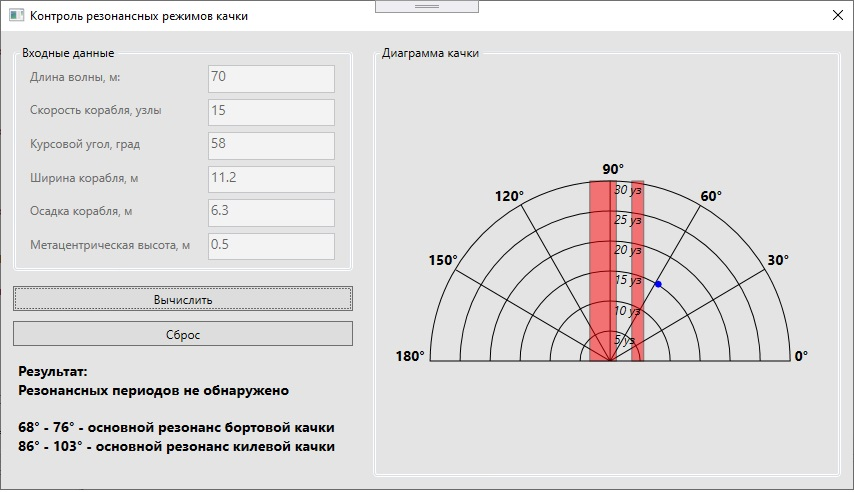
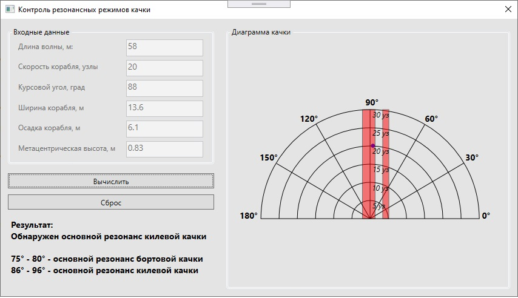

# Резонансные режимы качки
Система предназначена для контроля экстремальных ситуаций, 
связанных с оценкой резонансных режимов качки при движении 
судна на волнении.

Система написана на платформе WPF, язык C#.
## Система логических правил
Модель базы знаний содержит три логических правила, определяющих резонансные режимы качки корабля:

< if X1<sub>i</sub> is A1<sub>i</sub> & X2<sub>i</sub> is 
A2<sub>i</sub>, then Y<sub>i</sub> > (i=1,2,3)

где:
* X1 – заданная амплитуда качки, град.;
* Х2 – заданное соотношение частот в виде отношения частоты 
внешнего возмущения к частоте собственных колебаний корабля;
* А1 – граничное (пороговое) значение, определяющее амплитуду 
сильной качки; 
* А2 – неблагоприятная частная область, определяющая
резонансные режимы качки корабля;
* Y – значение курсового угла, определяющее выход корабля из 
области сильной качки; 
* i=1 – основной резонанс бортовой качки; 
* i=2 – параметрический резонанс бортовой качки; 
* i=3 – основной резонанс килевой качки. 

На основе исходной модели можно записать следующие правила:
```
1.ЕСЛИ амплитуда бортовой качки q>qm

И соотношение частот s/wq = (0,80 – 1,20),

ТО основной резонанс бортовой качки
```
```
2.ЕСЛИ амплитуда бортовой качки q>qm

И соотношение частот s/wq = (1,85 – 2,15),

ТО параметрический резонанс бортовой качки
```
```
3.ЕСЛИ амплитуда килевой качки y>ym

И соотношение частот s/wy = (0,80 – 1,20),

ТО основной резонанс килевой качки
```

## Информация для построения диаграммы качки
После завершения работы логических правил система устанавливает 
конкретный резонансный режим и для этого режима строит и выводит 
на экран диаграмму качки. На основании представленной информации 
оператор принимает окончательное решение о выборе условий 
штормования (курсовой угол и скорость судна).

Исходными данными для построения диаграммы качки являются 
скорость судна, курсовой угол, длина волны, собственные периоды 
бортовой и килевой качки. Все вычисления производятся по формуле:
```
tk = l/(CW – V cosj), (1)
```
где
* tk – кажущийся период волны;
* l – длина волны; 
* CW = 1,25*sqrt(l) – скорость бега волны; 
* j – курсовой угол волны (угол между направлением бега волн 
и диаметральной плоскостью судна).
* V - скорость судна, узлы

Из формулы (2) следует, что величина кажущегося периода изменяется
в зависимости от скорости V и курсового угла j, при этом на 
встречном волнении (j=180) Vcosj становится отрицательной 
и кажущийся период уменьшается.

Собственные периоды бортовой и килевой качки определяются по формулам:
```
tq = С*В/sqrt(h), ty = 2,5*sqrt(T), (3)
```
где 
* С = 0,8 – инерционный коэффициент; 
* В – ширина корабля, м; 
* h – поперечная метацентрическая высота, м ; 
* Т – осадка корабля, м.

Решая уравнение для tk относительно Vcosj, получаем
```
Vcosj = CW – (l/tk). (4)
```
Задаваясь соотношениями ```tk = (0,8–1,2)tq``` или 
```tk = (1,85–2,15)tq``` или ```tk = (0,8–1,2)ty```, 
можно получить неблагоприятные значения V и cosj,
при которых возможна сильная резонансная качка.

## HELP
Окно программы имеет три области:
* Входные данные (слева вверху)
* Диаграмма качки (правая половина окна)
* Результат (слева внизу)



В областе входных данных задаются такие данные, как:
* Длина волны, метры (допустимые значения от 1 до 90)
* Скорость корабля, узлы (допустимые значения от 0 до 30)
* Курсовой угол, градусы (допустимые значения от 0 до 180)
* Ширина корабля, метры (допустимые значения от 0 до 90)
* Осадка корабля, метры (допустимые значения от 0 до 24)
* Метацентрическая высота, метры (допустимые значения от 0 до 5)

После ввода корректных значений, активируется кнопка "Вычислить",
при нажатии на которую отрисовывается диграмма и в области "Результат"
отображаются точные границы обнаруженных диапазонов резонансов 
качки.

Для сброса результата вычисления и очистки диаграммы нужно нажать
кнопку "Сборс".

Направление бега волн на диаграмме – справа налево. Следовательно,
гребни волн можно представить в виде вертикальных линий. 
Исходящие из центра лучи представляют направления скорости
корабля, а радиусы концентрических окружностей – величины
скорости корабля в узлах. Курсовые углы показаны через 30.
Диаграммы симметричны относительно прямой 0 - 180 и поэтому 
вычерчивается только половина диаграммы.

Диаграмма качки строится для определенной длины волны и 
для определенного периода бортовой или вертикальной качки. 
Каждой паре значений скорости хода и курсового угла на диаграмме
соответствует некоторая точка. 
Если изменяется только скорость, то точка перемещается по лучу, 
а если изменяется только курсовой угол, то точка перемещается 
по окружности. При неизменном произведении Vcosj точка 
перемещается по вертикальной линии. Задаваясь значениями 
tk=0,8tq и tk=1,2tq, по формуле (4) можно вычислить 
соответствующие значения Vcosj. Отложив их от линии 
0 – 180 от полюса, можно провести на диаграмме две 
вертикали, между которыми заключается область 
неблагоприятной бортовой качки. Аналогичные построения 
выполняются при определении областей неблагоприятной качки 
при основном резонансе килевой качки и при параметрическом 
резонансе бортовой качки.

Пример работы программы:


